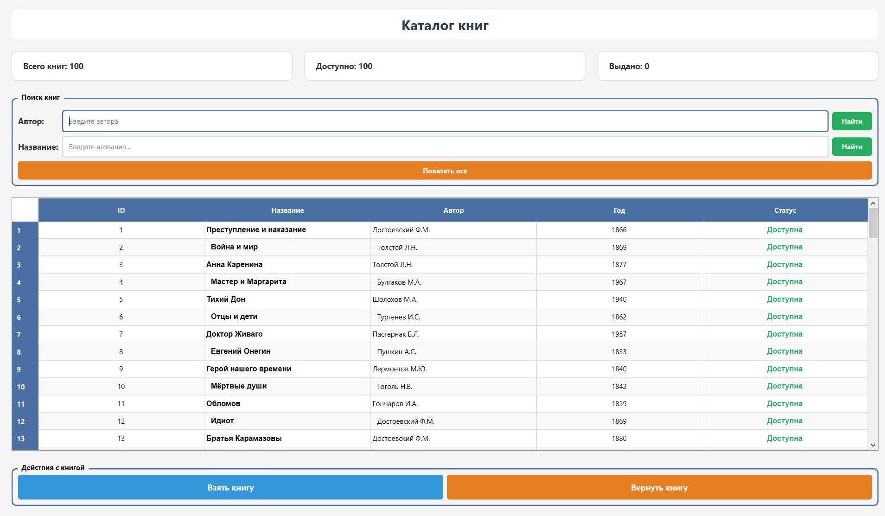
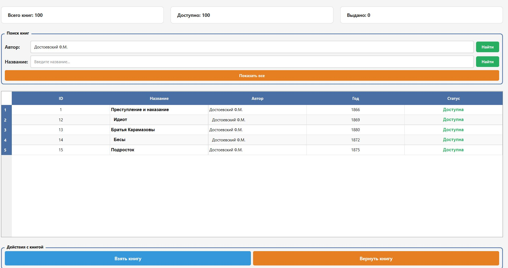
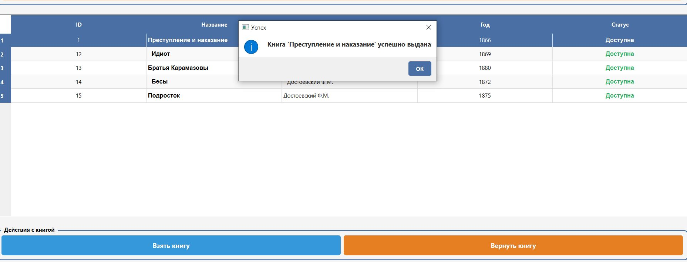
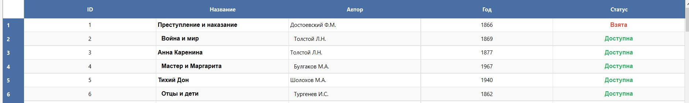
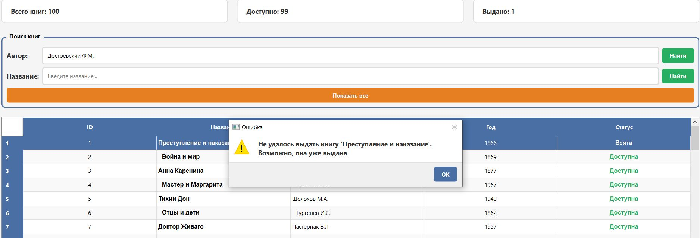

# Library Simulator — симулятор библиотеки на C++/Qt

**Library Simulator** — это десктопное приложение для автоматизации библиотечных процессов. Проект разделен на независимую логическую часть (C++ core) и графический интерфейс (Qt6), что делает код модульным и легко расширяемым.

## Цель проекта

Создать удобный инструмент для управления библиотечным каталогом, демонстрирующий:
- Чистую архитектуру с разделением на логику и интерфейс
- Работу с SQLite3 для хранения данных
- Современный C++ (17) с RAII

## Возможности

- **Просмотр каталога** — таблица со всеми книгами и их статусом
- **Поиск** — фильтрация книг по автору или названию
- **Выдача книг** — изменение статуса с проверкой доступности
- **Возврат книг** — автоматическое обновление статуса
- **Сохранение данных** — всё хранится в SQLite3
- **Qt интерфейс** — интуитивно понятное окно с таблицей

## Технологии

- **Язык**: C++17
- **GUI**: Qt6 Widgets
- **База данных**: SQLite3
- **Сборка**: CMake 3.20+

## Установка и запуск

### 1. Клонирование репозитория

```bash
git clone https://github.com/dinnksis/library.git
cd library

```

### 2. Сборка и запуск

```bash
# в корневой папке
mkdir build
cd build

# конфигурация 
cmake ..

# cборка
cmake --build . --config Release

cd bin/Release

#запуск от имени админа для внесения книг в бд
./library_admin    

# запуск программы
./library_gui     
```


## Демонстрация работы

### Главное окно
При запуске открывается главное окно со списком всех книг и статистикой.




### Поиск по автору




### Выдача книги
Выберите книгу в таблице и нажмите "Взять книгу".



### Выдача книги
Выберите книгу в таблице и нажмите "Взять книгу".




### Ошибка при возврате книги, которую не брали
Выберите выданную книгу и нажмите "Вернуть книгу".



